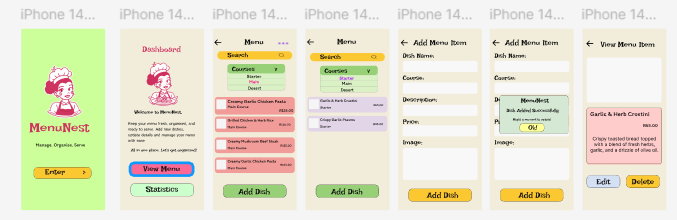

#  MenuNest
MenuNest is a menu management app built using **React Native, TypeScript**. The app allows for chef's to add dishes to a menu, organise them by course, view dish details, and upload an image for each dish.
# Author
Luyanda Mnisi 
ST10518910
## Features
### Splash Screen
- MenuNest logo 
- A "Enter" button to enter the app 
### Dashboard
- Welcome Screen 
- MenuNest Application intro
- Buttons for navigating to menu and stastics

### Menu 
- Displays dishes
- shows "No dish added" when the menu is empty 
- Course filtering:
  - Starter
  - Main
  -Dessert
- Different card colours for each course:
  - Starter: Lavender
  - Main: Coral/Pink
  - Dessert: Light Blue
- Scrollable dish list
- Each dish card can be pressed to view more details
- Add Dish button
### Add Menu Item
Users can add a new dish by entering:

- Dish Name
- Course
- Description
- Price
- Dish Image
When a dish is successfully added, a confirmation popup is displayed.
### View Menu Item
Users can view:

- Dish image
- Dish name
- Price
- Description

The screen also includes:

- Edit button
- Delete button
- Back navigation
## Application 

### Technologies Used

- React Native
- Expo
- TypeScript
- Expo Router
- Expo Image Picker
- Expo Font
# Links 
### YouTube
- [YouTube video](https://youtu.be/aMZnBvPGAZQ)
- Change quality to 1080p60
### GitHub
- [GitHub LiNK](https://github.com/luyandamnisi1010-beep/Chef-Menu_Manager.git)